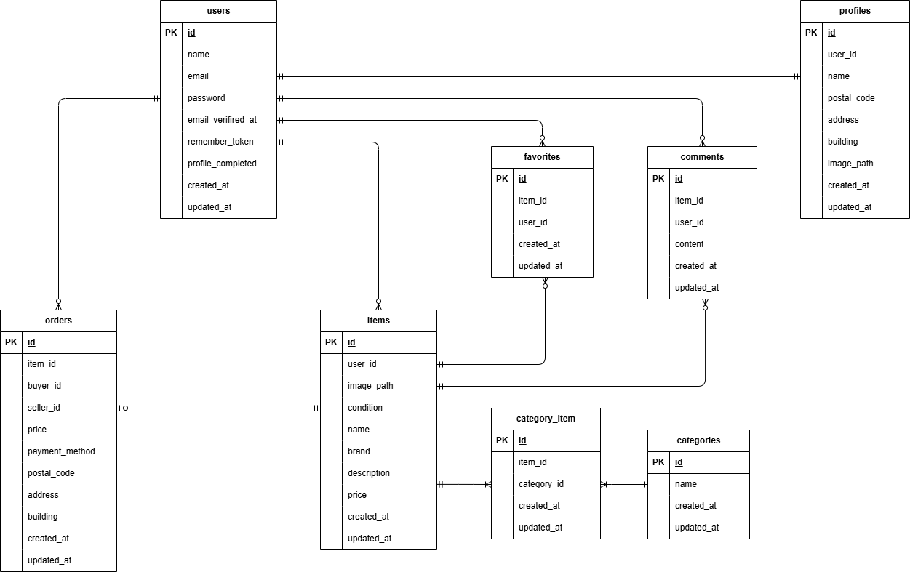

# CoachtechFleaMarket

## 環境構築
**Dockerビルド**
1. `git@github.com:ktpsc000/CoachtechFleaMarket.git`
2. `cd CoachtechFreaMarket`
2. DockerDesktopアプリを立ち上げる
3. `docker-compose up -d --build`

> *MacのM1・M2チップのPCの場合、`no matching manifest for linux/arm64/v8 in the manifest list entries`のメッセージが表示されビルドができないことがあります。
エラーが発生する場合は、docker-compose.ymlファイルの「mysql」内に「platform」の項目を追加で記載してください*
``` bash
mysql:
    platform: linux/x86_64(この文追加)
    image: mysql:8.0.26
    environment:
```

**Laravel環境構築**
1. `docker-compose exec php bash`
2. `composer install`
3. `composer require stripe/stripe-php`
4. 「.env.example」ファイルを 「.env」ファイルに命名を変更。または、新しく.envファイルを作成
5. .envに以下の環境変数を追加
``` text
DB_CONNECTION=mysql
DB_HOST=mysql
DB_PORT=3306
DB_DATABASE=laravel_db
DB_USERNAME=laravel_user
DB_PASSWORD=laravel_pass

MAIL_MAILER=smtp
MAIL_HOST=mailhog
MAIL_PORT=1025
MAIL_USERNAME=null
MAIL_PASSWORD=null
MAIL_ENCRYPTION=null
MAIL_FROM_ADDRESS=test@example.com
MAIL_FROM_NAME="${APP_NAME}"

STRIPE_KEY=pk_test_xxxxxxxxx
STRIPE_SECRET=sk_test_xxxxxxxxx
```
5. アプリケーションキーの作成
``` bash
php artisan key:generate
```

6. マイグレーションの実行
``` bash
php artisan migrate
```

7. シーディングの実行
``` bash
php artisan db:seed
```

## 使用技術(実行環境)
- PHP 8.1.34
- Laravel 8.83.29
- MySQL 8.0.26
- nginx 1.21.1
- mailhog

## ER図


## URL
- 開発環境：http://localhost/
- phpMyAdmin:：http://localhost:8080/


## 内容
購入時、カード決済の場合はstripe決済画面へ移行する
購入時のテストカード

※決済成功用
カード番号：4242 4242 4242 4242
有効期限：適当（例 12/34）
CVC：適当（例 123）
名前：適当

※決済失敗用
カード番号：4000 0000 0000 0002
